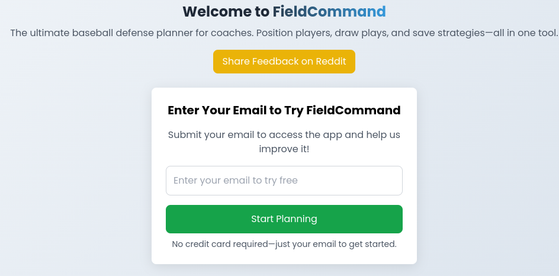
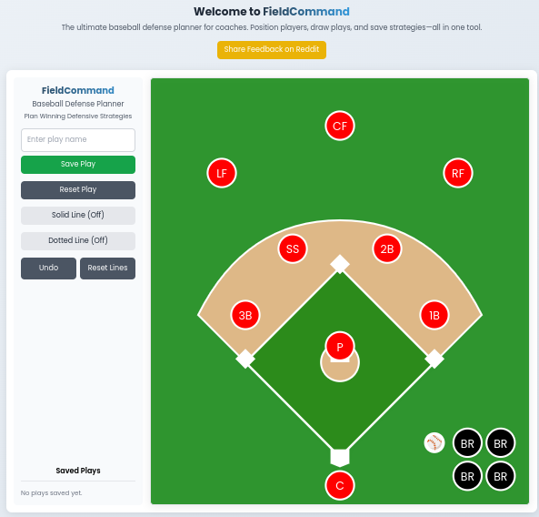

# FieldCommand: Baseball Defense Planner

FieldCommand is a lightweight, web-based tool designed for baseball coaches to plan and visualize defensive strategies. Easily drag players, draw plays, and save strategies for your team. Built as a proof-of-concept, we’d love your feedback to shape FieldCommand into the ultimate tool for baseball coaches!

## Live Demo

Try FieldCommand at: [https://fieldcommand.netlify.app/](https://fieldcommand.netlify.app/)

  
*Enter your email to unlock FieldCommand’s planning tools.*

  
*Drag players and draw plays on an interactive baseball field.*

## Features

- **Drag-and-Drop Players**: Position players (e.g., pitcher, catcher, outfielders) on a virtual baseball field.
- **Draw Plays**: Create solid or dotted lines to map defensive strategies. Demo mode allows 5 minutes of drawing per session (unlimited after email unlock).
- **Save and Load Plays**: Store plays locally and reload them for quick access.
- **Mobile-Friendly**: Works seamlessly on desktop and mobile devices.
- **Privacy-First**: Email submissions are hashed for analytics, ensuring GDPR/CCPA compliance.

## Usage

1. **Access the App**: Visit [fieldcommand.netlify.app](https://fieldcommand.netlify.app/).
2. **Email Gate**: Enter a valid email to unlock the app (no credit card required). Your email is anonymized for analytics.
3. **Plan Your Strategy**:
   - Drag players to reposition them on the field.
   - Enable "Solid Line" or "Dotted Line" mode to draw plays.
   - Save plays by entering a name and clicking "Save Play."
   - Load saved plays from the sidebar or reset to default positions.
4. **Share Feedback**: Join the discussion on [r/baseballcoaching](https://reddit.com/r/baseballcoaching) or [r/homeplate](https://reddit.com/r/homeplate), or open a GitHub Issue.

## Roadmap

We’re working to make FieldCommand even better! Planned features include:
- Export plays as images or PDFs.
- Team roster management.
- Collaborative mode for real-time planning.

Share your ideas on [GitHub Issues](https://github.com/frenchsoup/fieldcommand/issues)!

## Analytics

FieldCommand uses Google Analytics (GA4) to track user engagement in a privacy-compliant way:
- **Email Gate**: Tracked as `/email-gate`.
- **Main App**: Tracked as `/app`.
- Email addresses are hashed before tracking. No PII is stored, and data is retained for 26 months per GA4’s policy.

## Development

### Tech Stack
- **HTML/CSS/JavaScript**: Core structure and interactivity.
- **React (via CDN)**: Manages dynamic UI components.
- **Tailwind CSS**: Responsive styling.
- **Google Analytics (GA4)**: Anonymized user tracking.
- **Netlify**: Static site hosting.
- **GitHub**: Source code and deployment pipeline.

Source code: [github.com/frenchsoup/fieldcommand](https://github.com/frenchsoup/fieldcommand)

## Contributing

We welcome contributions! To get started:
1. Fork the repo.
2. Create a branch (`git checkout -b feature/your-feature`).
3. Commit changes (`git commit -m "Add your feature"`).
4. Push and open a Pull Request.

See [Issues](https://github.com/frenchsoup/fieldcommand/issues) for tasks or suggest new features.

## License

Licensed under the [MIT License](LICENSE).

## Contact

Reach out via:
- GitHub Issues: [github.com/frenchsoup/fieldcommand/issues](https://github.com/frenchsoup/fieldcommand/issues)